# Data Flow — v0.1.0

- **Status:** accepted (Phase 02 — Architecture)
- **Owner:** `technical-architect`
- **Last updated:** 2026-06-02
- **Source of truth for the components:** `.kitchen/architecture/extension-architecture.md`
- **Source of truth for the API surface:** `.kitchen/architecture/api-contract.md`

This document specifies the **runtime behaviour** of the
components named in `extension-architecture.md`. Where that
document pins down "what exists", this document pins down "when
it runs, in what order, and how the state moves". No code is
written in this phase — the diagrams and transitions are the
contract for the build phase to implement.

All diagrams are Mermaid (sequence diagrams for flows, state
diagrams for the modal state machine). The same style is used
throughout.

## 0. Reading guide

Every flow below is described twice: a **Mermaid sequence
diagram** for the call ordering, and a **one-paragraph
narration** that names the file, the function, and the trigger.
The build phase implements the narration; the diagram is the
specification, not the other way round.

The edge cases A–H (invalid key, expired key, network down,
rate limit, partial / empty data, 5-hour quota at 0%, region
mismatch, server-side transient error) are the same edge cases
the discovery record enumerated; the source-of-truth prose is
`.kitchen/discussion/2026-06-02-discovery.md` § "Edge cases".

## 1. First-run flow

The flow when the user has just installed the extension and has
no key in `SecretStorage` yet. The same diagram appears in
`extension-architecture.md` § 4 as ASCII; it is reproduced here
as a clean Mermaid sequence diagram with the file and function
names attached.

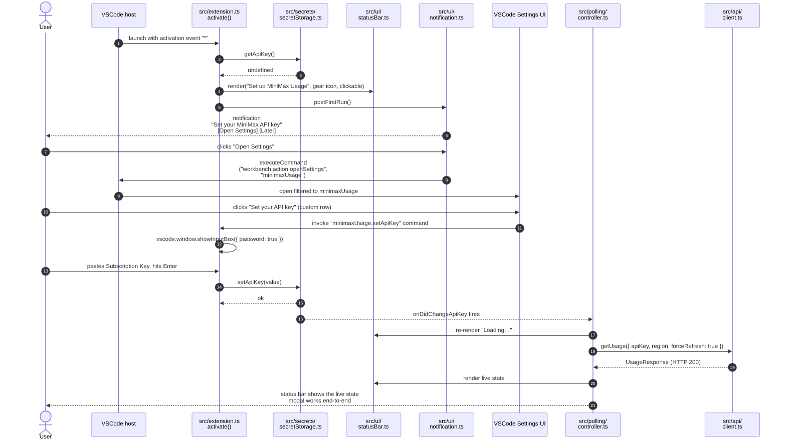

**Narration.** `src/extension.ts::activate()` runs when VSCode
starts (the `*` activation event). It asks
`src/secrets/secretStorage.ts::getApiKey()` for the key, gets
`undefined`, and renders the status bar in its "set up" state.
`src/ui/notification.ts::postFirstRun()` shows the first-run
notification. When the user clicks "Open Settings", the
notification handler calls
`vscode.commands.executeCommand("workbench.action.openSettings", "minimaxUsage")`,
which opens the Settings UI filtered to this extension. The
"Set your API key" row is contributed by the extension as a
custom command; clicking it invokes `minimaxUsage.setApiKey`,
which calls `vscode.window.showInputBox({ password: true })`. The
value is written straight to `SecretStorage` via
`src/secrets/secretStorage.ts::setApiKey()`. The
`onDidChangeApiKey` listener in `src/polling/controller.ts`
fires, the status bar transitions to "Loading…", and the
controller calls `getUsage({ forceRefresh: true })` (cache
bypassed because the key just changed). On success, the status
bar shows the live state and the modal works end-to-end.

## 2. Steady-state flow on status-bar click

The hot path. The user has a key in `SecretStorage`; the status
bar is showing the last known good state. They click the status
bar; the modal opens; the modal asks the host for the latest
data; the host returns it; the modal renders it.

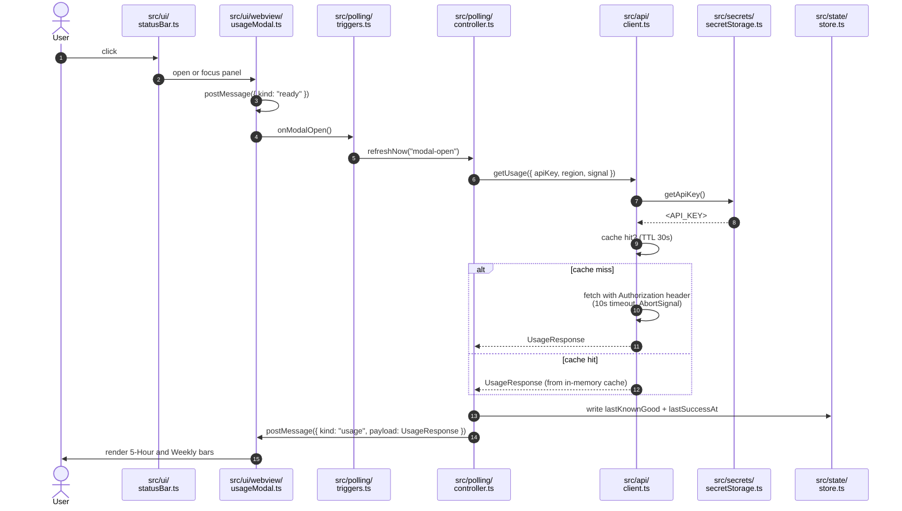

**Narration.** The user clicks the status bar. The
`StatusBarItem` command (registered in `src/extension.ts`)
opens or focuses a `WebviewPanel` via
`src/ui/webview/usageModal.ts::openOrFocus()`. The webview
posts `{ kind: "ready" }`; the host treats that as
"the modal is visible" and fires
`src/polling/triggers.ts::onModalOpen()`. The trigger calls
`PollingController::refreshNow("modal-open")`. The controller
acquires the API key from `SecretStorage` (passing it in to
the client; the controller does not retain it), invokes
`UsageClient::getUsage(...)`, and on success updates the
`StateStore` and posts a typed `UsageModalMessage` to the
modal. The modal renders the data. On error, see § 4.

The 30-second in-memory cache short-circuits the network call
when the modal opens within 30 seconds of the last successful
fetch. A user clicking the status bar repeatedly does not hit
the platform.

## 3. Polling flow

`PollingController` is the **single owner** of the background
60-second timer and the focus-gain / manual-click /
settings-change triggers. All triggers funnel into
`PollingController::refreshNow(reason)`, which debounces them
into one in-flight request. The `AbortController` lifecycle
travels with the request so a new trigger cancels any prior
in-flight call.

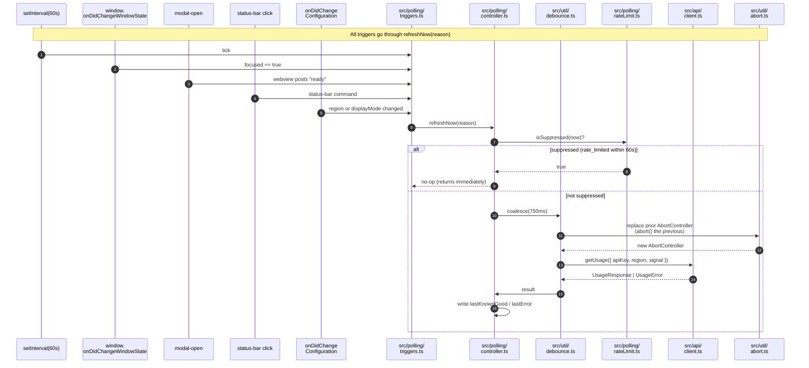

**Narration.** The five triggers — 60s timer tick, window focus
gain, modal open, status-bar manual click, settings change —
all call `src/polling/triggers.ts`, which forwards to
`PollingController::refreshNow(reason)`. The controller
short-circuits when `rateLimit.ts` reports the suppression flag
is set (see edge case D in § 4). When not suppressed, the
controller calls `src/util/debounce.ts::coalesce(750ms)`, which
guarantees only one in-flight request at a time and folds
concurrent calls into the most recent one.

Each call to `coalesce()` replaces the prior `AbortController`
via `src/util/abort.ts::createAbortController()`. The previous
controller's `abort()` is called; the in-flight `fetch`'s
`AbortSignal` is triggered; Node's HTTP client cancels the
socket. The new `AbortController`'s signal is plumbed through
`client.ts` → `retry.ts` → the underlying `fetch` call. The
shared signal is also the one cancelled in
`extension.ts::deactivate()` (see `extension-architecture.md` §
7.6).

After the result returns, the controller writes
`lastKnownGood` (on success) or `lastError` (on failure) to
the `StateStore`. The status bar's "stale" subtext is driven
by `lastSuccessAt` and `lastError.at`.

### 3.1 Settings-change reactions

Region change invalidates the cache (a cached response from
the overseas host is wrong for a mainland-China key) and fires
a `refreshNow()`. Display-mode change just re-renders the
status bar — no network call. See
`extension-architecture.md` § 5.2.

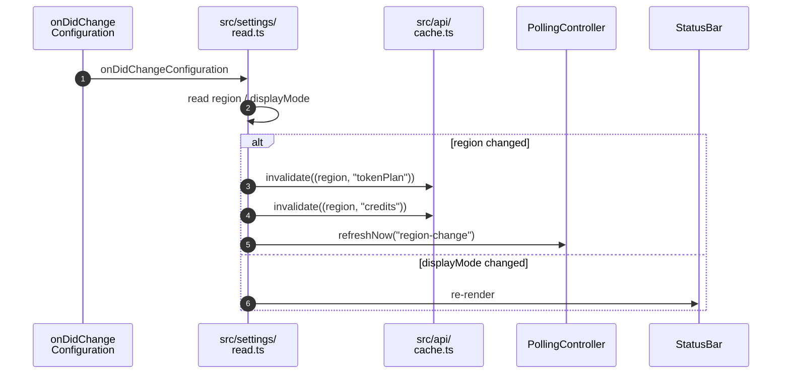

## 4. Error flows

One short Mermaid sequence diagram per error state (A–H from
the discovery record). Each diagram shows the trigger, the
detection, the UX, and the retry / no-retry decision.

### A. Invalid key

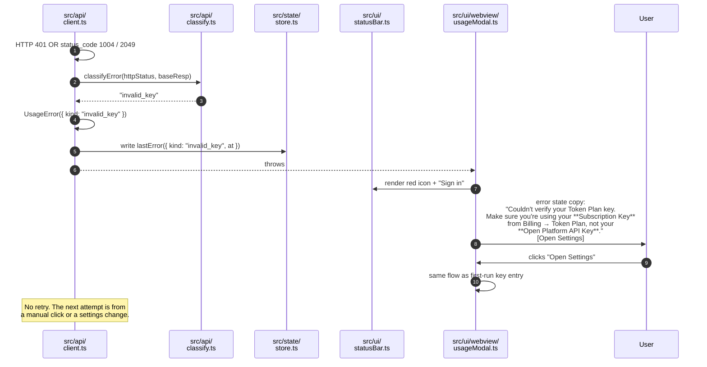

**Trigger.** Subscription Key is mistyped, revoked, replaced,
or the user pasted a Pay-as-you-go API Key by mistake. The
two key types are not interchangeable (api-contract.md § 1.1).

**Detection.** HTTP 401, or HTTP 200 with
`base_resp.status_code` in `{1004, 2049}` (api-contract.md §
2.3).

**UX.** Status bar: red icon, text "Sign in". Modal: invalid-
key error state with the Subscription Key vs Open Platform API
Key copy from the discovery record's "Decisions confirmed"
item 5. One "Open Settings" call to action. The "Open
Settings" link opens the same custom-input-box flow as
first-run.

**Retry.** No automatic retry. The next attempt is from a
manual click, a settings change, or a focus event after the
user has updated the key.

### B. Expired key

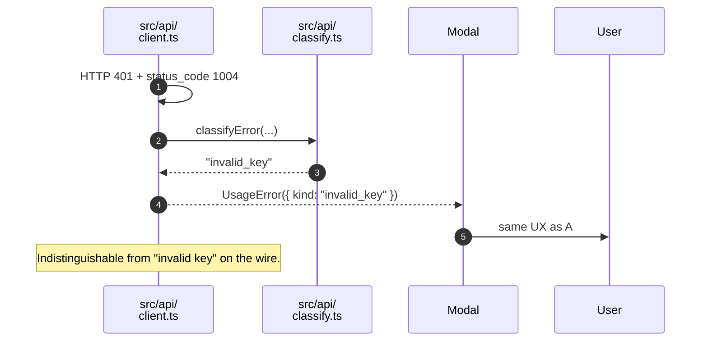

**Trigger.** Same as A. From the platform's point of view, an
expired key is the same as an invalid key (HTTP 401, `status_code:
1004` — "cookie is missing, log in again" — or 2049).

**Detection.** Same as A. The discovery phase found no
documented way to tell "expired" from "invalid" apart on the
wire.

**UX.** Same as A. The recovery path is identical: re-enter the
key.

**Retry.** No automatic retry. Same as A.

### C. Network down / DNS fail / connection refused

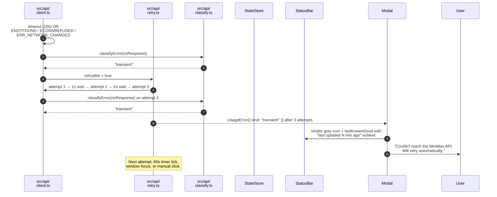

**Trigger.** No response (10s timeout, `ENOTFOUND`,
`ECONNREFUSED`, `ERR_NETWORK_CHANGED`).

**Detection.** Timeout, or an exception from the HTTP client
with no response object.

**UX.** Status bar: grey icon, text shows the **last known
good state** with a "last updated N min ago" subtext. The
status bar never goes blank. Modal: error state "Couldn't
reach the MiniMax API. Will retry automatically." No
user-visible retry button is required — the next attempt
happens automatically.

**Retry.** Yes, with exponential back-off (1s, 2s, 4s, capped
at 3 attempts) inside the request. After the 3 attempts
exhaust, the next eligible refresh is from the 60s background
tick, a window focus event, or a manual click. The controller
does not enter a long back-off state for transient network
errors — only rate-limit (D) does that.

### D. Rate limit

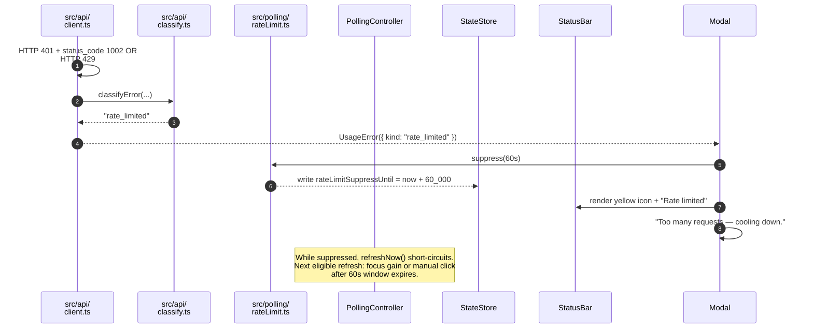

**Trigger.** HTTP 401 with `base_resp.status_code: 1002` (rate
limit), HTTP 429 if the platform uses it, or any other
throttling signal.

**Detection.** `classifyError()` returns `"rate_limited"`.

**UX.** Status bar: yellow icon, text "Rate limited". Modal:
"Too many requests — cooling down." The extension does **not**
surface a separate countdown timer for the cool-down — the
user just sees the next attempt when it happens.

**Retry.** No automatic retry. `rateLimit.ts` sets a 60-second
suppression flag. While the flag is set, every
`PollingController::refreshNow()` call short-circuits without
hitting the network. The next eligible refresh is from a
focus event after the window expires, or a manual click. The
status bar mirrors the suppressed state with the yellow
badge.

### E. Partial / empty data

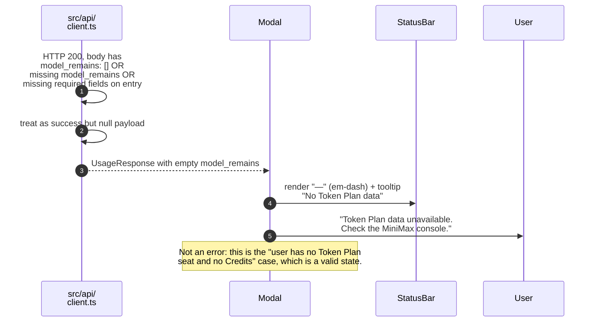

**Trigger.** HTTP 200 but the body is missing `model_remains`,
`model_remains` is empty, or the entry is missing the fields
the extension reads.

**Detection.** `client.ts` parses the response; if the parsed
`UsageResponse` has an empty `model_remains` or the first
entry is missing required fields, it returns the parsed
response with a flag indicating "no renderable data". This is
treated as **success**, not an error — the platform answered,
the user just has no plan seat.

**UX.** Status bar: "—" (em-dash) with tooltip "No Token Plan
data". Modal: "Token Plan data unavailable. Check the MiniMax
console." No red icon, no retry button.

**Retry.** Yes, normal cadence. This is not an error; the
next tick / focus / click refreshes normally.

### F. 5-hour quota at 0% (exhausted but not errored)

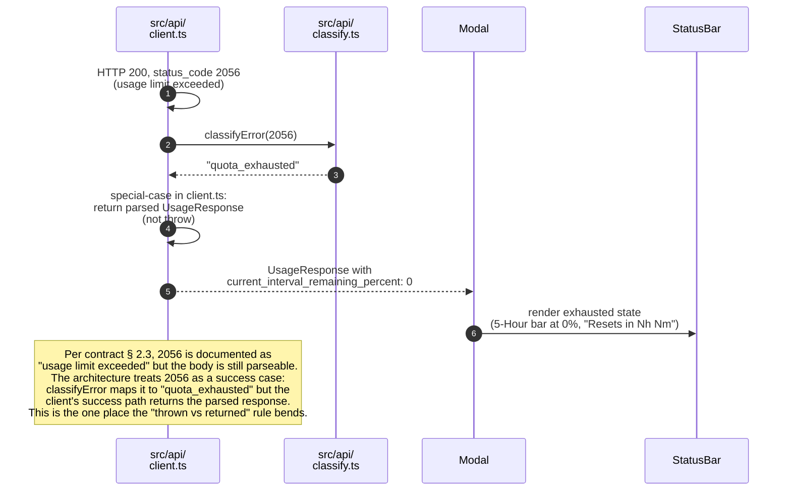

**Trigger.** HTTP 200, `current_interval_remaining_percent:
0` (and possibly `base_resp.status_code: 2056`).

**Detection.** `classifyError(2056) → "quota_exhausted"`, but
the client's success path special-cases 2056 to **return** the
parsed `UsageResponse` rather than throw, because the body is
parseable and the modal can render "0% remaining". This is
documented in `extension-architecture.md` § 7.8 as the one
place the "thrown vs returned" rule bends.

**UX.** Status bar: the 5-Hour Limit at 0%, the Weekly Limit
unchanged, a subtext "Resets in Nh Nm". Modal: same data, no
red icon, no error state.

**Retry.** Yes, normal cadence. This is not an error.

### G. Region mismatch

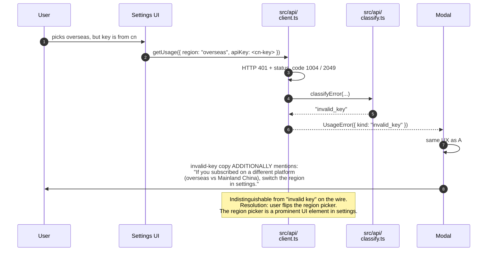

**Trigger.** User has a mainland-China Subscription Key but
the extension is configured for the overseas host, or vice
versa.

**Detection.** HTTP 401 with `base_resp.status_code: 1004` or
`2049`. Indistinguishable from "invalid key" on the wire.

**UX.** Same as A. The invalid-key error copy additionally
mentions: "If you subscribed on a different platform (overseas
vs Mainland China), switch the region in settings." The
region picker is a prominent element in the settings UI so
the user notices the toggle.

**Retry.** No automatic retry. The next attempt is from a
settings change (the user flips the region) or a manual
click.

### H. Server-side transient error

```mermaid
sequenceDiagram
    autonumber
    participant Client as src/api/<br/>client.ts
    participant Retry as src/api/<br/>retry.ts
    participant Cls as src/api/<br/>classify.ts
    participant Store as StateStore
    participant SB as StatusBar
    participant Modal as Modal

    Client->>Client: HTTP 5xx OR<br/>status_code 1000 / 1001 / 1024 / 1033 / 1039
    Client->>Cls: classifyError(...)
    Cls-->>Client: "transient"
    Client->>Retry: retryable = true
    Retry->>Client: attempt 1 → 1s → attempt 2 → 2s → attempt 3
    Client->>Cls: classifyError(...) on attempt 3
    Cls-->>Client: "transient"
    Retry-->>Modal: UsageError({ kind: "transient" }) after 3 attempts
    Modal->>SB: render lastKnownGood with "stale" subtext
    Modal->>User: "MiniMax API temporarily unavailable.<br/>Will retry."
    Note over Retry: Next attempt: 60s timer tick, focus, or manual click.<br/>Differs from C: the response was received; the issue is server-side.
```

**Trigger.** HTTP 5xx, or `base_resp.status_code` in
`{1000, 1001, 1024, 1033, 1039}`.

**Detection.** `classifyError()` returns `"transient"`.

**UX.** Status bar: last known good state with a "stale"
subtext. Modal: "MiniMax API temporarily unavailable. Will
retry." The extension does not flip into a red error state;
the data is still renderable from the last successful
response.

**Retry.** Yes, with exponential back-off (1s, 2s, 4s, capped
at 3 attempts) inside the request. After the 3 attempts
exhaust, the next eligible refresh is from the 60s
background tick, a window focus event, or a manual click.
This differs from C in that the response was received; the
issue is server-side.

### 4.x Unknown / unrecognised `status_code`

For completeness — this is the catch-all when the platform
returns a `base_resp.status_code` that is not in
`KnownStatusCode` (api-contract.md § 5).

**Detection.** `classifyError(unknown) → "unknown"`. The retry
policy treats `unknown` as transient (retries with back-off);
if all attempts fail, the surface message is the generic
"Couldn't reach the MiniMax API" (same as C).

## 5. Modal state machine

The modal's visible state is a small state machine driven by
the result of the most recent `refreshNow()` and by the
`StateStore`'s `lastKnownGood` / `lastError`. The status bar
mirrors the modal's state with a coarser UI (one icon + one
text + one tooltip).

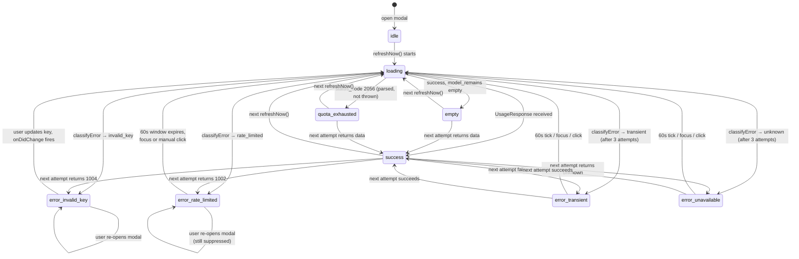

### 5.1 States

| State | Visible | Trigger |
| --- | --- | --- |
| `idle` | Modal shell, no data. | First open before any fetch has run. |
| `loading` | "Loading…" subtext, the prior data (if any) dimmed. | A `refreshNow()` is in flight. |
| `success` | 5-Hour and Weekly bars render; countdowns tick. | `UsageResponse` received with non-empty `model_remains`. |
| `empty` | "Token Plan data unavailable. Check the MiniMax console." | `UsageResponse` received with empty `model_remains` (edge case E). |
| `quota_exhausted` | 5-Hour bar at 0%, "Resets in Nh Nm" subtext. | `status_code: 2056` (edge case F). The state is rendered, not thrown. |
| `error:invalid_key` | Invalid-key error state (A, B, G). | `classifyError → "invalid_key"`. |
| `error:rate_limited` | Rate-limit error state (D). | `classifyError → "rate_limited"`. |
| `error:transient` | Transient error state (C, H). | `classifyError → "transient"` after 3 attempts. |
| `error:unavailable` | "Couldn't reach the MiniMax API." | `classifyError → "unknown"` after 3 attempts. |

### 5.2 Transitions and triggers

| From | To | Trigger |
| --- | --- | --- |
| `idle` | `loading` | First `refreshNow()` after modal open. |
| `loading` | `success` | `UsageResponse` with non-empty `model_remains`. |
| `loading` | `empty` | `UsageResponse` with empty `model_remains`. |
| `loading` | `quota_exhausted` | `status_code: 2056` (special-cased to return the parsed response, not throw). |
| `loading` | `error:invalid_key` | `classifyError → "invalid_key"`. |
| `loading` | `error:rate_limited` | `classifyError → "rate_limited"`. |
| `loading` | `error:transient` | `classifyError → "transient"` after 3 retry attempts. |
| `loading` | `error:unavailable` | `classifyError → "unknown"` after 3 retry attempts. |
| `success` / `empty` / `quota_exhausted` | `loading` | Next `refreshNow()` (timer, focus, click, settings change). |
| `error:*` | `loading` | Recovery event: 60s tick, focus, manual click, or — for `error:invalid_key` — a key change via `onDidChangeApiKey`. |
| `error:rate_limited` | (suppressed) | While `rateLimitSuppressUntil > now`, every `refreshNow()` short-circuits and the state does not change. The next eligible refresh is a focus event after the window expires. |

### 5.3 Status-bar mirroring

The status bar is a one-icon, one-text, one-tooltip projection
of the modal state machine. The mapping is:

| Modal state | Status-bar icon | Status-bar text | Tooltip |
| --- | --- | --- | --- |
| `idle` | grey `$(loading~spin)` | "Loading…" | "Fetching usage…" |
| `loading` | grey `$(loading~spin)` | "Loading…" | "Fetching usage…" |
| `success` | green `$(check)` | "5h: 75% · 7d: 94%" | "5h resets in 2h 14m · 7d resets in 5d 3h" |
| `empty` | grey `$(dash)` | "No plan" | "No Token Plan data — see the MiniMax console" |
| `quota_exhausted` | yellow `$(warning)` | "5h: 0%" | "5h resets in 1h 02m · 7d resets in 5d 3h" |
| `error:invalid_key` | red `$(error)` | "Sign in" | "Subscription Key is invalid or missing — open settings" |
| `error:rate_limited` | yellow `$(warning)` | "Rate limited" | "Too many requests — cooling down" |
| `error:transient` | grey `$(sync)` | last-known-good (dimmed) | "Last updated N min ago — MiniMax API unavailable" |
| `error:unavailable` | grey `$(sync)` | last-known-good (dimmed) | "Last updated N min ago — couldn't reach the MiniMax API" |

The status bar always shows **something** — it never goes
blank, even on a first activation with no key (the "Set up"
state). The "last-known-good dimmed" rows above are driven by
`StateStore.lastKnownGood` and `lastSuccessAt`; if no
`lastKnownGood` exists, the text is the generic "Sign in" /
"Loading…" and the tooltip says "No usage data yet".

## 6. Cross-references

- `.kitchen/architecture/extension-architecture.md` — the
  components named in every diagram above.
- `.kitchen/architecture/api-contract.md` § 2.3 — the error
  table that drives `classifyError`.
- `.kitchen/discussion/2026-06-02-discovery.md` § "Edge cases"
  — the source-of-truth prose for the user-facing UX in § 4.
- `.kitchen/architecture/security.md` — the redaction rules
  the logger applies to every flow above (the API key never
  appears in a log line, an error message, or a URL).
- `.kitchen/architecture/build-and-publish.md` — the
  Vitest-testable units (`classifyError`, the cache, the
  retry policy, the rate-limit flag, the logger) that this
  document assumes.
