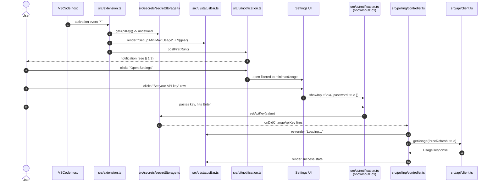

# v0.1.0 User Flow — Wireframes

- **Status:** in review (Phase 03 — Design)
- **Owners:** `ux-designer` (flow), `ui-designer` (visual), `ux-writer` (text)
- **Last updated:** 2026-06-02
- **Source of truth for components:** `.kitchen/architecture/extension-architecture.md`
- **Source of truth for runtime behaviour:** `.kitchen/architecture/data-flow.md`
- **Source of truth for copy:** `.kitchen/design/strings-v0.1.0.md`
- **Source of truth for visual treatment:** `.kitchen/design/ui-spec-v0.1.0.md`

This document is the wireframe-level user flow for the v0.1.0
user path. It covers install → API key entry → settings → status
bar click → usage modal, including every error state and the
"Credits Balance unavailable" state mandated by the discovery
record.

The 9 modal states from `data-flow.md` § 5 are: `idle`, `loading`,
`success`, `empty`, `quota_exhausted`, `error:invalid_key`,
`error:rate_limited`, `error:transient`, `error:unavailable`.
Each state has a wireframe in § 5 of this document. The 8
edge cases A–H from the discovery record map to the modal
states as follows (this mapping is the same as in
`data-flow.md` § 4):

| Discovery edge case | Modal state | Notes |
| --- | --- | --- |
| A — invalid key | `error:invalid_key` | Includes the Subscription Key vs Open Platform API Key copy. |
| B — expired key | `error:invalid_key` | Indistinguishable on the wire; same UX as A. |
| C — network down | `error:transient` | Status bar shows last-known-good with "stale" subtext. |
| D — rate limit | `error:rate_limited` | 60-second suppression; no countdown timer. |
| E — partial / empty | `empty` | Treated as success, not an error. |
| F — 5-hour at 0% | `quota_exhausted` | Rendered state, not thrown. |
| G — region mismatch | `error:invalid_key` | Same UX as A; copy additionally mentions the region toggle. |
| H — server transient | `error:transient` | Same UX as C; copy says "temporarily unavailable". |

## 0. Conventions used in the wireframes

The wireframes below are ASCII at 360px viewport width unless
explicitly noted. ASCII characters only; no box-drawing
characters that break in monospace fallbacks.

The icons are shown as `$(symbol-name)` (the same octicon
identifiers the visual spec uses — see `ui-spec-v0.1.0.md`).
The text after the icon is the literal user-facing string from
`strings-v0.1.0.md` (the `ID` is referenced inline; the
implementation phase imports by ID).

A wireframe that is repeated identically in a different state
is referenced by name, not re-drawn. For example, every error
state shares the same modal **header** and **footer**; only the
**error block** in the middle changes.

The status bar appears at the bottom of every wireframe. The
modal is a centred `WebviewPanel`. The notification is a
non-modal VSCode notification toast.

## 1. First-run flow

The flow when the user has just installed the extension and has
no key in `SecretStorage` yet. This is the sequence from
`data-flow.md` § 1, restated with the wireframes attached.

### 1.1 Sequence overview



### 1.2 Status bar — "set up" state (no key)

The status bar item is **always** rendered (it is the only
"click to open" surface the extension has). When there is no
key, it is a clickable "set up" prompt — the user can reach
the API-key input box by clicking it directly, without going
through the notification.

```
+----------------------------------------------------------------------+
|  ... editor content ...                                              |
|                                                                      |
|                                                                      |
|                                                                      |
+----------------------------------------------------------------------+
|  $(gear)  Set up MiniMax Usage                                  <--  |  <- status bar (clickable)
+----------------------------------------------------------------------+
```

- Icon: `$(gear)` (per `ui-spec-v0.1.0.md` § 2.1).
- Text: `STR_STATUSBAR_SETUP` ("Set up MiniMax Usage").
- Tooltip: `STR_STATUSBAR_SETUP_TOOLTIP` ("Enter your MiniMax Subscription Key to start").
- Click → `src/ui/notification.ts::postSetUpPrompt()`, which is
  the same `showInputBox` the notification's "Open Settings"
  button eventually reaches.

### 1.3 First-run notification

A non-blocking VSCode notification toast. It is **not** a popup
and **not** a webview. It is the prompt that introduces the
extension to the user on first install.

```
+----------------------------------------------------------+
|  Set your MiniMax API key                                |
|                                                          |
|  Get your Subscription Key from the MiniMax platform.    |
|  You can find it under Billing -> Token Plan.            |
|                                                          |
|  [ Open Settings ]   [ Later ]                           |
+----------------------------------------------------------+
```

- Title: `STR_FIRST_RUN_NOTIFICATION_TITLE` ("Set your MiniMax API key").
- Body: `STR_FIRST_RUN_NOTIFICATION_BODY` ("Get your Subscription Key from the MiniMax platform. You can find it under Billing → Token Plan.").
- Primary button: `STR_FIRST_RUN_NOTIFICATION_OPEN_SETTINGS` ("Open Settings"). Triggers `commands.executeCommand("workbench.action.openSettings", "minimaxUsage")`.
- Secondary button: `STR_FIRST_RUN_NOTIFICATION_LATER` ("Later"). Dismisses the notification; the status-bar item remains clickable.

**Constraints.** Per `extension-architecture.md` § 4, the
notification is shown **only** when
`SecretStorage.getApiKey()` returns `undefined` at activation.
Re-prompting mid-session after a key delete is out of scope;
the status bar enters `error:invalid_key` and the modal's
"Open Settings" button is the recovery path.

### 1.4 Settings UI — first arrival on `minimaxUsage`

When the user clicks "Open Settings", the Settings UI opens
filtered to the `minimaxUsage` section. Three rows are visible:

- **`minimaxUsage.region`** (enum picker) — see § 3.2 for
  layout.
- **`minimaxUsage.displayMode`** (enum picker) — see § 3.3 for
  layout.
- **"Subscription Key"** (custom command row, contributed by
  the extension) — see § 1.5.

```
+----------------------------------------------------------+
|  Settings                                          [ x ] |
+----------------------------------------------------------+
|  Extensions  >  MiniMax Usage                             |
+----------------------------------------------------------+
|  >  User                                               v |
|                                                          |
|  [search settings.................................]       |
|                                                          |
|  Common configurations                                   |
|                                                          |
|  MiniMax Usage: Region                                   |
|  Overseas platform — platform.minimax.io (default)  v    |
|                                                          |
|  MiniMax Usage: Display Mode                             |
|  Token Plan — 5-Hour and Weekly progress bars  v         |
|                                                          |
|  Subscription Key                                        |
|  Set or update your MiniMax Subscription Key             |
|  [ Set your API key ]                                    |
|                                                          |
+----------------------------------------------------------+
```

- `minimaxUsage.region` row uses the
  `STR_SETTINGS_REGION_MD_DESC` markdown description from
  `strings-v0.1.0.md`.
- `minimaxUsage.displayMode` row uses the
  `STR_SETTINGS_DISPLAYMODE_MD_DESC` markdown description.
- "Subscription Key" row is a custom contribution — see
  `extension-architecture.md` § 5.1. The label and description
  come from `STR_SETTINGS_APIKEY_LABEL` and
  `STR_SETTINGS_APIKEY_DESC`. The button label is
  `STR_SETTINGS_APIKEY_BUTTON` ("Set your API key").

### 1.5 "Set your API key" custom input box

Clicking the "Subscription Key" row's button (or the status
bar's "Set up" item) opens a `showInputBox` with `password:
true`. The prompt is the only place the user pastes the key
in v0.1.0; the Settings UI's built-in `secret` field is not
used.

```
+----------------------------------------------------------+
|  Paste your Subscription Key                            |
|  > sk-cp-................................                |
|  (............)                                          |
+----------------------------------------------------------+
```

- Prompt: `STR_APIKEY_INPUTBOX_PROMPT` ("Paste your Subscription Key").
- Placeholder: `STR_APIKEY_INPUTBOX_PLACEHOLDER` ("sk-cp-…").
- `password: true` — the input is masked.
- Validation (immediate, on Enter):
  - If the value is empty → keep the input box open; the input
    box is not dismissed.
  - If the value does not start with the documented prefix —
    see `extension-architecture.md` § 7.1 for what the build
    phase treats as "looks like a key" — surface
    `STR_APIKEY_INPUTBOX_VALIDATION_ERROR` ("Subscription Keys start with `sk-cp-`. Check that you copied the full key from Billing → Token Plan.") and re-open the input box.
  - If the value passes the shape check, write to
    `SecretStorage` and dismiss. A confirmation toast appears:
    `STR_APIKEY_INPUTBOX_SUCCESS` ("Subscription Key saved. MiniMax Usage will refresh.").

The value is written straight to `SecretStorage` and never
round-trips through the Settings JSON. The webview is not
involved at any point in the first-run path.

### 1.6 Status bar — "loading" state (after key save)

After the key is saved, the `onDidChangeApiKey` listener fires.
The status bar re-renders to the loading state; the modal is
not yet open.

```
+----------------------------------------------------------------------+
|  ... editor content ...                                              |
+----------------------------------------------------------------------+
|  $(loading~spin)  Loading...                                   <--  |  <- status bar
+----------------------------------------------------------------------+
```

- Icon: `$(loading~spin)` (per `ui-spec-v0.1.0.md` § 2.1).
- Text: `STR_STATUSBAR_LOADING` ("Loading…").
- Tooltip: `STR_STATUSBAR_LOADING_TOOLTIP` ("Fetching usage…").

When the first successful response arrives, the status bar
transitions to the steady-state success projection (see § 2.1).
If the first response is an error, the status bar transitions
to the corresponding error state (see § 5).

### 1.7 Modal becomes available

Once the status bar is showing the live state, clicking it
opens the modal at the success state. The modal's first
visible state is always `loading` (per `data-flow.md` § 2),
but the cache hit on the first `refreshNow()` (the 30-second
in-memory cache populated by the `getUsage({ forceRefresh: true })`
from § 1.1) short-circuits the network call. The user sees
the data render within one frame.

The modal wireframe is in § 2.2.

## 2. Steady-state flow on status-bar click

The hot path. The user has a key; the status bar is showing
the last-known-good state; the user clicks; the modal opens.

### 2.1 Status bar — success state (steady)

The status bar shows the two percentages from
`current_interval_remaining_percent` and
`current_weekly_remaining_percent`. The format is fixed and
matches `data-flow.md` § 5.3.

```
+----------------------------------------------------------------------+
|  ... editor content ...                                              |
+----------------------------------------------------------------------+
|  $(check)  5h: 75% · 7d: 94%                                   <--  |  <- status bar (clickable)
+----------------------------------------------------------------------+
```

- Icon: `$(check)` (green) — see `ui-spec-v0.1.0.md` § 2.1.
- Text: `STR_STATUSBAR_SUCCESS` ("5h: {5hPercent}% · 7d: {7dPercent}%"). The template is fixed; only the two numbers are substituted. The "5h" / "7d" abbreviations are intentional (status bars are narrow).
- Tooltip: `STR_STATUSBAR_SUCCESS_TOOLTIP` ("5h resets in {5hReset} · 7d resets in {7dReset}"). The `{5hReset}` / `{7dReset}` values are rendered by the same "Resets in" formatter used in the modal (see `ui-spec-v0.1.0.md` § 3.3).
- Click → open the modal at the `success` state. The modal
  fires its own `refreshNow("modal-open")` (per
  `data-flow.md` § 2); the 30-second in-memory cache
  short-circuits the network call when the click happens
  within 30 seconds of the last successful fetch.

### 2.2 Modal — success state (360px viewport)

ASCII at 360px viewport width. The modal is centred in the
editor; the content is constrained to a 360px reading column
inside the panel.

```
+--------------------------------------------------------+
|  MiniMax Usage                              [ x ]     |  <- header
+--------------------------------------------------------+
|                                                        |
|  5-Hour Limit                                          |  <- block title
|  [========================........] 75% remaining      |  <- progress bar
|  Quota used 25%                                        |
|  Resets in 2h 14m                                      |
|                                                        |
|  ---                                                   |
|                                                        |
|  Weekly Limit                                          |
|  [============================........] 94% remaining |
|  Quota used 6%                                         |
|  Resets in 5d 3h                                       |
|                                                        |
+--------------------------------------------------------+
|  Last updated 12s ago       Open Settings              |  <- footer
+--------------------------------------------------------+
```

- Header title: `STR_MODAL_TITLE_TOKENPLAN` ("MiniMax Usage")
  in `tokenPlan` mode. In `credits` mode the title is
  `STR_MODAL_TITLE_CREDITS` ("Credits"); in `both` mode the
  title is `STR_MODAL_TITLE_BOTH` ("MiniMax Usage").
- Close button: standard VSCode `$(close)` (the right-hand `x`
  in the panel chrome — contributed by VSCode, not by the
  modal).
- Block titles: `STR_BLOCK_5H_TITLE` ("5-Hour Limit"),
  `STR_BLOCK_WEEKLY_TITLE` ("Weekly Limit").
- Progress bar value labels:
  - "X% remaining" — `STR_BAR_REMAINING` template.
  - "Quota used X%" — `STR_BAR_QUOTA_USED` template. The value
    is computed as `100 − remaining_percent` per the discovery
    record's "Decisions confirmed" item 4.
- Resets labels: `STR_BAR_RESETS_IN` template ("Resets in Xh Ym").
- Footer: `STR_FOOTER_LAST_UPDATED` template ("Last updated {N}s/m/h ago"), `STR_FOOTER_OPEN_SETTINGS` ("Open Settings"). The footer is identical across modal states (except for the "last updated" timestamp).
- The Credits block is omitted in `tokenPlan` mode. The
  display-mode picker is documented in § 3.3.

### 2.3 Modal — success state (720px viewport, "Both" mode)

At 720px viewport width with `displayMode = "both"`, the
modal has the same shape as the 360px version, with the
Credits block appended at the bottom. The progress bars span
the same horizontal extent; the percentages and the
"Resets in" labels align vertically with the block titles.
The 720px layout is **not** a 2-column layout — the modal
stays single-column. The 720px width buys more whitespace and
a wider progress bar; it does not introduce a side-by-side
Credits / Token Plan grid.

```
+----------------------------------------------------------------------------+
|  MiniMax Usage                                                  [ x ]     |
+----------------------------------------------------------------------------+
|                                                                            |
|  5-Hour Limit                                                              |
|  [==================================........] 75% remaining                |
|  Quota used 25%                                                            |
|  Resets in 2h 14m                                                          |
|                                                                            |
|  ---                                                                       |
|                                                                            |
|  Weekly Limit                                                              |
|  [====================================........] 94% remaining              |
|  Quota used 6%                                                             |
|  Resets in 5d 3h                                                           |
|                                                                            |
|  ---                                                                       |
|                                                                            |
|  Credits Balance                                                           |
|  $24.50 remaining                                                          |
|  2,450 credits                                                             |
|                                                                            |
+----------------------------------------------------------------------------+
|  Last updated 12s ago                       Open Settings                   |
+----------------------------------------------------------------------------+
```

- Credits block title: `STR_BLOCK_CREDITS_TITLE` ("Credits Balance").
- Credits block line: `STR_CREDITS_BALANCE` template ("{amount} remaining"). The amount and the credit count are derived from the credits-endpoint response. The "amount" and "credit count" fields are both shown when the response carries them; otherwise the modal shows only what the response provides.

### 2.4 Modal — loading state (transient)

When a `refreshNow()` is in flight while the modal is open,
the prior data is **dimmed** (per `data-flow.md` § 5.1) and a
"Loading…" subtext appears under the footer. The progress
bars are not re-drawn until the response lands.

```
+--------------------------------------------------------+
|  MiniMax Usage                              [ x ]     |
+--------------------------------------------------------+
|                                                        |
|  5-Hour Limit                                          |
|  [========================........] 75% remaining      |  <- dimmed
|  Quota used 25%                                        |
|  Resets in 2h 14m                                      |
|                                                        |
|  ---                                                   |
|                                                        |
|  Weekly Limit                                          |
|  [============================........] 94% remaining |  <- dimmed
|  Quota used 6%                                         |
|  Resets in 5d 3h                                       |
|                                                        |
+--------------------------------------------------------+
|  Loading...                                  (--:--%)  |  <- footer subtext
|  Last updated 12s ago       Open Settings              |
+--------------------------------------------------------+
```

- Loading subtext: `STR_FOOTER_LOADING` ("Loading…").
- The dimmed-data treatment is the same as the
  `ui-spec-v0.1.0.md` § 4.3 "loading" treatment for the
  progress bars (lower opacity, no animation).

## 3. Settings UI — display mode and region

### 3.1 Settings entry points

The settings UI is reached from:

1. The first-run notification's "Open Settings" button.
2. The invalid-key error state's "Open Settings" button (see § 5.2).
3. The status bar's "Sign in" state (per § 5.2).
4. The footer "Open Settings" link in the modal (always present).
5. The VSCode command palette: `> MiniMax Usage: Open Settings`.

All five paths resolve to the same view: the Settings UI
filtered to `minimaxUsage`.

### 3.2 Region picker

The region picker is **prominent** in the settings UI because
a wrong region surfaces as `error:invalid_key` and the user
should see the toggle before they look at the error state.

```
+----------------------------------------------------------+
|  MiniMax Usage: Region                                   |
|                                                          |
|  Which MiniMax platform the Subscription Key is bound    |
|  to. Overseas users have keys from                       |
|  platform.minimax.io; Mainland China users have keys     |
|  from platform.minimaxi.com. If you subscribed on a      |
|  different platform, change this setting — a wrong       |
|  region will surface as 'invalid key'.                   |
|                                                          |
|  [ Overseas platform — platform.minimax.io (default) v ] |
|                                                          |
|      Overseas platform — platform.minimax.io (default)   |
|      Mainland China platform — platform.minimaxi.com     |
|                                                          |
+----------------------------------------------------------+
```

- `markdownDescription` is `STR_SETTINGS_REGION_MD_DESC` (long
  form quoted in `strings-v0.1.0.md`).
- `enumDescriptions` are `STR_SETTINGS_REGION_ENUM_0` and
  `STR_SETTINGS_REGION_ENUM_1`.
- Default value: `"overseas"`.
- A wrong value cannot be entered — the picker is constrained
  to the enum.

### 3.3 Display mode picker

```
+----------------------------------------------------------+
|  MiniMax Usage: Display Mode                             |
|                                                          |
|  What the status bar and modal show.                     |
|                                                          |
|  [ Token Plan — 5-Hour and Weekly progress bars  v ]     |
|                                                          |
|      Token Plan — 5-Hour and Weekly progress bars        |
|      Credits — Balance only                              |
|      Both — Token Plan and Credits side by side          |
|                                                          |
+----------------------------------------------------------+
```

- `markdownDescription` is `STR_SETTINGS_DISPLAYMODE_MD_DESC`
  ("What the status bar and modal show.").
- `enumDescriptions` are `STR_SETTINGS_DISPLAYMODE_ENUM_0/1/2`.
- Default value: `"tokenPlan"`.
- The picker is **disabled** (greyed out) for `credits` and
  `both` when the credits-endpoint is in the "unavailable"
  state (see § 5.9). The disabled state shows the
  `STR_SETTINGS_DISPLAYMODE_DISABLED_HINT` subtext ("Credits endpoint unavailable — coming in a future version") and a small `$(info)` icon. The build phase implements this with a custom `onDidChangeConfiguration` listener that toggles a `disabled` flag on the picker's UI; the architecture does not model this in the settings schema (it is a runtime UI state, not a configuration value), so a follow-up ADR is **not** required.

### 3.4 Display-mode impact on the modal

| `displayMode` | Modal block layout |
| --- | --- |
| `tokenPlan` | 5-Hour block, Weekly block, footer. No Credits block. |
| `credits` | Credits block, footer. No 5-Hour / Weekly blocks. The modal title is `STR_MODAL_TITLE_CREDITS` ("Credits"). |
| `both` | 5-Hour block, Weekly block, Credits block, footer. The modal title is `STR_MODAL_TITLE_BOTH` ("MiniMax Usage"). |

The Credits block is the same in `credits` and `both` modes.

### 3.5 Region change — cache invalidate + refresh

When the user flips the region picker, the `onDidChangeConfiguration`
listener in `src/settings/read.ts` invalidates the in-memory
cache for both the Token Plan and the Credits endpoint
keyed by the old region, then fires a `refreshNow("region-change")`
on `PollingController` (per `data-flow.md` § 3.1).

```
+----------------------------------------------------------+
|  MiniMax Usage: Region                                   |
|  [ Mainland China platform — platform.minimaxi.com  v ]  |
+----------------------------------------------------------+
           |
           v  (selection change)
+----------------------------------------------------------+
|  Status bar: $(loading~spin)  Loading...                 |  <- 750ms debounce
+----------------------------------------------------------+
           |
           v  (response lands)
+----------------------------------------------------------+
|  Status bar: $(check)  5h: 75% · 7d: 94%                 |  <- success, OR
|  Status bar: $(error)  Sign in                            |  <- invalid_key (region mismatch)
+----------------------------------------------------------+
```

### 3.6 Display-mode change — no network call

When the user flips the display mode picker, the status bar
and modal re-render against the **same** data; no new HTTP
request is made (per `data-flow.md` § 3.1). The user sees the
modal swap to the new block layout within one frame.

```
+----------------------------------------------------------+
|  MiniMax Usage: Display Mode                             |
|  [ Both — Token Plan and Credits side by side      v ]   |
+----------------------------------------------------------+
           |
           v  (selection change, no debounce, no fetch)
+----------------------------------------------------------+
|  Modal re-renders:                                      |
|   - 5-Hour Limit block                                   |
|   - Weekly Limit block                                   |
|   - Credits Balance block                                |
+----------------------------------------------------------+
```

If the user picks `credits` or `both` while the credits
endpoint is in the "unavailable" state, the modal shows the
"Credits Balance unavailable" wireframe from § 5.9 in place of
the Credits block. The Token Plan blocks continue to render
from the cached data.

## 4. Status-bar projection of every modal state

The status bar is a one-icon, one-text, one-tooltip projection
of the modal state. The full mapping is in
`data-flow.md` § 5.3 and is restated in
`ui-spec-v0.1.0.md` § 2.1. For flow purposes, the per-state
status-bar appearance is:

| Modal state | Icon | Text | Wireframe |
| --- | --- | --- | --- |
| `idle` | `$(loading~spin)` (grey) | "Loading…" | identical to `loading` |
| `loading` | `$(loading~spin)` (grey) | "Loading…" | § 1.6 |
| `success` | `$(check)` (green) | "5h: 75% · 7d: 94%" | § 2.1 |
| `empty` | `$(dash)` (grey) | "No plan" | § 5.5 |
| `quota_exhausted` | `$(warning)` (yellow) | "5h: 0%" | § 5.6 |
| `error:invalid_key` | `$(error)` (red) | "Sign in" | § 5.2 |
| `error:rate_limited` | `$(warning)` (yellow) | "Rate limited" | § 5.3 |
| `error:transient` | `$(sync)` (grey) | last-known-good (dimmed) | § 5.4 |
| `error:unavailable` | `$(sync)` (grey) | last-known-good (dimmed) | § 5.4 (same shape) |

The status bar **always** shows something — it never goes
blank, even on a first activation with no key (the
"Set up" state from § 1.2).

## 5. Modal and status-bar wireframes per state

This section is the source of truth for "every modal state
has a wireframe". Each subsection has three things:

1. The **modal** wireframe at 360px (the error block replaces
   the data block; the header and footer are shared).
2. The **status bar** wireframe (one line of ASCII; the status
   bar is always the bottom of the editor).
3. The **recovery call-to-action** (text only; the button
   label is from `strings-v0.1.0.md`).

The header and footer of the modal are identical across
states — only the middle "block" changes. To keep the
wireframes readable, the header is collapsed to a `---` and
the footer is collapsed to a `...`. The actual header and
footer are documented once in § 2.2 and reused here.

The modal states that render **data** (success, empty,
quota_exhausted) use the data block from § 2.2. The modal
states that render **errors** use the error block from § 5.1
(with per-state colour and copy variants).

### 5.1 Error block — shared frame

Every error modal state uses the same block shape, with a
per-state coloured left-border, title, body, and
call-to-action button(s). The visual treatment is in
`ui-spec-v0.1.0.md` § 4.4.

```
|  +----------------------------------------------------+  |  <- coloured left border
|  |  STR_ERROR_{state}_TITLE                            |  |  <- error title
|  |                                                    |  |
|  |  STR_ERROR_{state}_BODY                            |  |  <- error body (1-2 sentences)
|  |                                                    |  |
|  |  [ STR_ERROR_{state}_CTA_PRIMARY ]                 |  |  <- primary call to action
|  |  [ STR_ERROR_{state}_CTA_SECONDARY ]               |  |  <- secondary, if any
|  +----------------------------------------------------+  |
```

The left-border colour is per state (see `ui-spec-v0.1.0.md`
§ 4.4):
- `error:invalid_key` → red
- `error:rate_limited` → yellow
- `error:transient` → grey
- `error:unavailable` → grey

### 5.2 State `error:invalid_key` (edge cases A, B, G)

Covers: mistyped key, revoked key, replaced key, expired key,
Pay-as-you-go key mistakenly pasted, region mismatch (overseas
key + cn host, or vice versa).

**Modal at 360px (the data block is replaced by the error block):**

```
+--------------------------------------------------------+
|  MiniMax Usage                              [ x ]     |
+--------------------------------------------------------+
|                                                        |
|  +--------------------------------------------------+  |
|  |  Couldn't verify your Token Plan key             |  |  <- red left border
|  |                                                  |  |
|  |  Make sure you're using your Subscription Key    |  |
|  |  from Billing > Token Plan, not your Open        |  |
|  |  Platform API Key from Account > Basic           |  |
|  |  Information.                                    |  |
|  |                                                  |  |
|  |  If you subscribed on a different platform       |  |
|  |  (overseas vs Mainland China), switch the region  |  |
|  |  in settings.                                    |  |
|  |                                                  |  |
|  |  [ Open Settings ]                               |  |
|  +--------------------------------------------------+  |
|                                                        |
+--------------------------------------------------------+
|  Last updated 12s ago       Open Settings              |
+--------------------------------------------------------+
```

- Error title: `STR_ERROR_INVALIDKEY_TITLE` ("Couldn't verify your Token Plan key").
- Error body: `STR_ERROR_INVALIDKEY_BODY` (the two-paragraph copy: the Subscription Key vs Open Platform API Key distinction + the region hint). The body is one string with a paragraph break in it; the UI splits on the break.
- Primary CTA: `STR_ERROR_INVALIDKEY_CTA_PRIMARY` ("Open Settings"). Triggers the same `showInputBox` flow as the first-run path.
- Secondary CTA: none.
- The "Open Settings" footer link is still present, in
  addition to the in-block button — both reach the same flow.

**Status bar:**

```
+----------------------------------------------------------------------+
|  $(error)  Sign in                                            <--   |  <- red icon, red text
+----------------------------------------------------------------------+
```

- Icon: `$(error)` (red) — `ui-spec-v0.1.0.md` § 2.1.
- Text: `STR_STATUSBAR_INVALIDKEY` ("Sign in").
- Tooltip: `STR_STATUSBAR_INVALIDKEY_TOOLTIP` ("Subscription Key is invalid or missing — open settings").
- Click → opens the modal at the `error:invalid_key` state.
  The "Open Settings" button inside the modal (or in the
  footer) reaches the `showInputBox` flow.

**Note on the region hint.** The region's hint is **always**
present in the `error:invalid_key` body, not just when the
user has actually mismatched regions. We cannot tell
"mistyped key" from "region mismatch" on the wire
(`data-flow.md` § 4 G), so the hint is always there. This
saves the user a "where is the region toggle?" moment.

### 5.3 State `error:rate_limited` (edge case D)

The platform returned `base_resp.status_code: 1002` (or 429,
or 2045). The polling controller has set a 60-second
suppression flag; the next eligible refresh is from focus
gain or manual click after the window expires.

**Modal at 360px:**

```
+--------------------------------------------------------+
|  MiniMax Usage                              [ x ]     |
+--------------------------------------------------------+
|                                                        |
|  +--------------------------------------------------+  |
|  |  Too many requests                                |  |  <- yellow left border
|  |                                                  |  |
|  |  Cooling down. The next refresh will happen      |  |
|  |  automatically within a minute.                  |  |
|  |                                                  |  |
|  |  [ Dismiss ]                                     |  |
|  +--------------------------------------------------+  |
|                                                        |
+--------------------------------------------------------+
|  Last updated 12s ago       Open Settings              |
+--------------------------------------------------------+
```

- Error title: `STR_ERROR_RATELIMITED_TITLE` ("Too many requests").
- Error body: `STR_ERROR_RATELIMITED_BODY` ("Cooling down. The next refresh will happen automatically within a minute."). Per `data-flow.md` § 4 D, the extension does not surface a separate countdown timer.
- Primary CTA: `STR_ERROR_RATELIMITED_CTA_PRIMARY` ("Dismiss"). Closes the modal; the status bar continues to show the yellow "Rate limited" state.
- Secondary CTA: none.
- The footer "Last updated" timestamp continues to reflect the
  last successful response.

**Status bar:**

```
+----------------------------------------------------------------------+
|  $(warning)  Rate limited                                        <-- |  <- yellow icon, yellow text
+----------------------------------------------------------------------+
```

- Icon: `$(warning)` (yellow) — `ui-spec-v0.1.0.md` § 2.1.
- Text: `STR_STATUSBAR_RATELIMITED` ("Rate limited").
- Tooltip: `STR_STATUSBAR_RATELIMITED_TOOLTIP` ("Too many requests — cooling down").
- Click → opens the modal at the `error:rate_limited` state.
  The status bar does not flip to "Loading…" on the click —
  the click short-circuits through the suppressed state until
  the 60-second window expires.

### 5.4 States `error:transient` and `error:unavailable` (edge cases C, H)

These two states share a wireframe shape and a status-bar
shape. The difference is in the error-block title and body —
"transient" surfaces for network-down / DNS fail / connection
refused, and "unavailable" surfaces for unknown status codes
(the platform returned a `base_resp.status_code` not in
`KnownStatusCode`, or the body could not be classified at all).

**Modal at 360px (`error:transient`):**

```
+--------------------------------------------------------+
|  MiniMax Usage                              [ x ]     |
+--------------------------------------------------------+
|                                                        |
|  +--------------------------------------------------+  |
|  |  Couldn't reach the MiniMax API                   |  |  <- grey left border
|  |                                                  |  |
|  |  Will retry automatically.                        |  |
|  |                                                  |  |
|  |  [ Dismiss ]                                     |  |
|  +--------------------------------------------------+  |
|                                                        |
+--------------------------------------------------------+
|  Last updated 5 min ago       Open Settings             |
+--------------------------------------------------------+
```

**Modal at 360px (`error:unavailable`):**

```
+--------------------------------------------------------+
|  MiniMax Usage                              [ x ]     |
+--------------------------------------------------------+
|                                                        |
|  +--------------------------------------------------+  |
|  |  MiniMax API temporarily unavailable              |  |  <- grey left border
|  |                                                  |  |
|  |  Will retry.                                      |  |
|  |                                                  |  |
|  |  [ Dismiss ]                                     |  |
|  +--------------------------------------------------+  |
|                                                        |
+--------------------------------------------------------+
|  Last updated 5 min ago       Open Settings             |
+--------------------------------------------------------+
```

- `error:transient` — title: `STR_ERROR_TRANSIENT_TITLE` ("Couldn't reach the MiniMax API"), body: `STR_ERROR_TRANSIENT_BODY` ("Will retry automatically.").
- `error:unavailable` — title: `STR_ERROR_UNAVAILABLE_TITLE` ("MiniMax API temporarily unavailable"), body: `STR_ERROR_UNAVAILABLE_BODY` ("Will retry.").
- Primary CTA (both): `STR_ERROR_TRANSIENT_CTA_PRIMARY` /
  `STR_ERROR_UNAVAILABLE_CTA_PRIMARY` ("Dismiss"). Closes the
  modal; the status bar continues to show the last-known-good
  with the "stale" subtext.
- The footer "Last updated" timestamp is the **last successful
  fetch**, not the moment the error started. The "stale"
  framing lives in the tooltip, not the modal.

**Status bar (both states — identical shape):**

```
+----------------------------------------------------------------------+
|  $(sync)  5h: 75% · 7d: 94% (stale)                            <--   |  <- grey icon, dimmed text
+----------------------------------------------------------------------+
```

- Icon: `$(sync)` (grey) — `ui-spec-v0.1.0.md` § 2.1.
- Text: `STR_STATUSBAR_TRANSIENT` / `STR_STATUSBAR_UNAVAILABLE` template — same shape as the success state ("5h: 75% · 7d: 94%") with a "(stale)" suffix.
- Tooltip: `STR_STATUSBAR_TRANSIENT_TOOLTIP` / `STR_STATUSBAR_UNAVAILABLE_TOOLTIP` ("Last updated 5 min ago — MiniMax API unavailable" / "Last updated 5 min ago — couldn't reach the MiniMax API"). The "5 min ago" is a function of `StateStore.lastSuccessAt`, not a fixed string.
- The status bar continues to show the last-known-good
  projection so the user always has a number to read.

### 5.5 State `empty` (edge case E)

The user has no Token Plan seat and no Credits. The platform
answered HTTP 200 with `model_remains` empty (or missing the
fields the extension reads). This is **not** an error — the
user just has nothing to display.

**Modal at 360px:**

```
+--------------------------------------------------------+
|  MiniMax Usage                              [ x ]     |
+--------------------------------------------------------+
|                                                        |
|                  $(info)                               |  <- centred icon
|                                                        |
|        Token Plan data unavailable.                    |  <- title
|        Check the MiniMax console.                      |  <- body
|                                                        |
+--------------------------------------------------------+
|  Last updated 12s ago       Open Settings              |
+--------------------------------------------------------+
```

- Title: `STR_EMPTY_TITLE` ("Token Plan data unavailable.").
- Body: `STR_EMPTY_BODY` ("Check the MiniMax console.").
- Icon: `$(info)` (centred) — `ui-spec-v0.1.0.md` § 2.1.
- No call-to-action buttons. The footer "Open Settings" link
  is still there but is for setting changes, not recovery.
- The Credits block in `both` mode is also empty (rendered
  with the same `STR_EMPTY_TITLE` / `STR_EMPTY_BODY` — the
  error text is identical for both empty cases).

**Status bar:**

```
+----------------------------------------------------------------------+
|  $(dash)  No plan                                              <--   |  <- grey icon, grey text
+----------------------------------------------------------------------+
```

- Icon: `$(dash)` (grey) — `ui-spec-v0.1.0.md` § 2.1.
- Text: `STR_STATUSBAR_EMPTY` ("No plan").
- Tooltip: `STR_STATUSBAR_EMPTY_TOOLTIP` ("No Token Plan data — see the MiniMax console").
- Click → opens the modal at the `empty` state.

### 5.6 State `quota_exhausted` (edge case F)

The 5-hour quota is at 0%. The platform returned HTTP 200
with `current_interval_remaining_percent: 0` and possibly
`base_resp.status_code: 2056`. This is **not** an error —
the body is parseable, the modal renders the 0%, and the
"Resets in" countdown continues to tick.

**Modal at 360px:**

```
+--------------------------------------------------------+
|  MiniMax Usage                              [ x ]     |
+--------------------------------------------------------+
|                                                        |
|  5-Hour Limit                                          |
|  [..............................................] 0%  |  <- bar fully filled red
|  Quota used 100%                                       |
|  Resets in 1h 02m                                      |
|                                                        |
|  ---                                                   |
|                                                        |
|  Weekly Limit                                          |
|  [============================........] 94% remaining |
|  Quota used 6%                                         |
|  Resets in 5d 3h                                       |
|                                                        |
+--------------------------------------------------------+
|  Last updated 12s ago       Open Settings              |
+--------------------------------------------------------+
```

- The 5-Hour block is rendered exactly as in the success
  state — the 0% value, the 100% "Quota used", the "Resets
  in" countdown. No error block; no yellow/red icon on the
  status bar.
- The bar is **fully filled** (the "remaining 0%" means the
  bar is at the right end) and uses the red colour stop
  (`var(--vscode-charts-red)` per `ui-spec-v0.1.0.md` § 3.2).
- The Weekly block continues to render normally. The
  exhaustion is **per-window** — a 5-hour exhaust does not
  affect the Weekly window's data.

**Status bar:**

```
+----------------------------------------------------------------------+
|  $(warning)  5h: 0%                                            <--   |  <- yellow icon, yellow text
+----------------------------------------------------------------------+
```

- Icon: `$(warning)` (yellow) — `ui-spec-v0.1.0.md` § 2.1.
- Text: `STR_STATUSBAR_QUOTA_EXHAUSTED` ("5h: 0%").
- Tooltip: `STR_STATUSBAR_QUOTA_EXHAUSTED_TOOLTIP` ("5h resets in 1h 02m · 7d resets in 5d 3h").
- The Weekly window is **not** in the status-bar text (status
  bars are narrow; the 0% is the salient data point).
- Click → opens the modal at the `quota_exhausted` state.
  The modal shows the full data, including the Weekly block.

### 5.7 Modal — `loading` (cold open)

The first time the user opens the modal after a fresh
activation, the cache is empty and the first `refreshNow()`
is in flight. The modal shows the empty block (no data) and
the loading subtext in the footer.

```
+--------------------------------------------------------+
|  MiniMax Usage                              [ x ]     |
+--------------------------------------------------------+
|                                                        |
|                  $(loading~spin)                       |  <- centred spinner
|                                                        |
|                  Fetching usage...                     |  <- centred body
|                                                        |
+--------------------------------------------------------+
|  Loading...                                  (--:--%) |
|  Last updated never       Open Settings                |
+--------------------------------------------------------+
```

- Centred icon: `$(loading~spin)`.
- Centred body: `STR_MODAL_LOADING_BODY` ("Fetching usage…").
- Footer "Last updated": `STR_FOOTER_LAST_UPDATED_NEVER` ("Last updated never") on the first ever open; "Last updated 12s ago" thereafter.

This state is **distinct** from the steady-state `loading`
state (§ 2.4) where the prior data is dimmed. There is no
prior data to dim on a cold open. The implementation can
treat the two as the same `loading` state and just have
`lastKnownGood` be `null` for the cold-open case.

### 5.8 Modal — `idle` (first open, no refresh yet)

The `idle` state from `data-flow.md` § 5.1 is the modal
shell before any `refreshNow()` has been triggered. In
practice, the modal opens and immediately fires
`onModalOpen()` which triggers a `refreshNow()` — the user
never sees `idle` for more than a single frame. The
wireframe is the same as the cold-open `loading` state in
§ 5.7; the `idle` and `loading` states share the same
visual treatment.

### 5.9 State "Credits Balance unavailable" (Credits endpoint failure)

Per the discovery record's "Decisions confirmed" item 3, if
the credits endpoint rejects Bearer auth (or returns a
non-recoverable error on every candidate in
`extension-architecture.md` § 7.9.2), the extension surfaces
a "Credits Balance unavailable" message and the `credits` /
`both` display-mode picker entries are greyed out. This is
**not** a 10th modal state — it is a sub-state of the
display-mode UI. The Token Plan blocks continue to render
normally from the `token_plan/remains` data.

**Modal — `displayMode = "both"` with credits unavailable:**

The 5-Hour and Weekly blocks render from the live
`token_plan/remains` data. The Credits block is replaced by
a "unavailable" placeholder block.

```
+--------------------------------------------------------+
|  MiniMax Usage                              [ x ]     |
+--------------------------------------------------------+
|                                                        |
|  5-Hour Limit                                          |
|  [========================........] 75% remaining      |
|  Quota used 25%                                        |
|  Resets in 2h 14m                                      |
|                                                        |
|  ---                                                   |
|                                                        |
|  Weekly Limit                                          |
|  [============================........] 94% remaining |
|  Quota used 6%                                         |
|  Resets in 5d 3h                                       |
|                                                        |
|  ---                                                   |
|                                                        |
|  Credits Balance                                       |
|                                                        |
|  +--------------------------------------------------+  |
|  |  $(info)                                          |  |
|  |                                                  |  |
|  |  Credits Balance unavailable from the official   |  |
|  |  API.                                            |  |
|  |                                                  |  |
|  |  Coming in a future version.                     |  |
|  +--------------------------------------------------+  |
|                                                        |
+--------------------------------------------------------+
|  Last updated 12s ago       Open Settings              |
+--------------------------------------------------------+
```

- Credits block title: `STR_BLOCK_CREDITS_TITLE` ("Credits Balance") — same as in the success state.
- Placeholder title: `STR_CREDITS_UNAVAILABLE_TITLE` ("Credits Balance unavailable from the official API.").
- Placeholder body: `STR_CREDITS_UNAVAILABLE_BODY` ("Coming in a future version.").
- Placeholder icon: `$(info)` (centred) — `ui-spec-v0.1.0.md` § 2.1.
- No call-to-action buttons. The footer "Open Settings" link is still there.
- The user can still see the Token Plan data; the only
  difference from the success state is the Credits block is
  the unavailable placeholder.

**Modal — `displayMode = "credits"` with credits unavailable:**

```
+--------------------------------------------------------+
|  MiniMax Usage                              [ x ]     |
+--------------------------------------------------------+
|                                                        |
|                                                        |
|                  $(info)                               |
|                                                        |
|        Credits Balance unavailable                     |
|        from the official API.                          |
|                                                        |
|        Coming in a future version.                     |
|                                                        |
+--------------------------------------------------------+
|  Last updated 12s ago       Open Settings              |
+--------------------------------------------------------+
```

- This is the modal's centred "empty" layout (same as
  `empty` in § 5.5), with the credits-unavailable strings.
- The user has nothing to see; the recommendation is to
  switch to `tokenPlan` mode to see the live data.

**Display-mode picker — `credits` and `both` greyed out:**

```
+----------------------------------------------------------+
|  MiniMax Usage: Display Mode                             |
|                                                          |
|  What the status bar and modal show.                     |
|                                                          |
|  [ Token Plan — 5-Hour and Weekly progress bars  v ]     |
|                                                          |
|      Token Plan — 5-Hour and Weekly progress bars        |
|      Credits — Balance only                              |  <- greyed out
|      Both — Token Plan and Credits side by side          |  <- greyed out
|                                                          |
|  $(info)  Credits endpoint unavailable — coming in a     |
|           future version                                 |
|                                                          |
+----------------------------------------------------------+
```

- The two greyed-out options have the
  `STR_SETTINGS_DISPLAYMODE_DISABLED_HINT` subtext under the
  picker: "Credits endpoint unavailable — coming in a future
  version".
- The `info` icon next to the hint is the standard
  `$(info)` octicon.
- The user can still pick `tokenPlan`; the `credits` and
  `both` options are visible but the click does nothing
  (the UI is disabled, not hidden — the architecture decision
  per `extension-architecture.md` § 7.9.3).

**Status bar — `displayMode = "both"` with credits unavailable:**

The status bar is unchanged from the success state — the
Token Plan projections still render. The credits line of
the status-bar text is omitted in `tokenPlan` and `both`
modes (the status bar shows only the 5h and 7d percentages).

**Status bar — `displayMode = "credits"` with credits unavailable:**

```
+----------------------------------------------------------------------+
|  $(dash)  Credits unavailable                                   <-- |  <- grey icon, grey text
+----------------------------------------------------------------------+
```

- Icon: `$(dash)` (grey).
- Text: `STR_STATUSBAR_CREDITS_UNAVAILABLE` ("Credits unavailable").
- Tooltip: `STR_STATUSBAR_CREDITS_UNAVAILABLE_TOOLTIP` ("Credits Balance unavailable from the official API").
- The status bar never lies — when the credits endpoint is
  unavailable, the status bar says so. The user is not
  shown a stale "credits" number.

## 6. Settings-change reactions

A summary of what happens when the user changes a setting.
The sequence diagrams are in `data-flow.md` § 3.1. The
wireframes are:

### 6.1 Region change

Already covered in § 3.5. The status bar transitions through
`loading` to either `success` (cache miss + valid key) or
`error:invalid_key` (cache miss + region mismatch).

### 6.2 Display-mode change

Already covered in § 3.6. No network call; the modal and
status bar re-render against the cached data.

### 6.3 Key change (via `showInputBox`)

The user can update the key at any time from the
`error:invalid_key` modal state or from the settings UI's
"Set your API key" row. The flow is identical to the
first-run § 1.5 flow, except the `onDidChangeApiKey` listener
is the trigger (not the `activate()` listener).

The `onDidChangeApiKey` listener invalidates the cache for
the **old** key's snapshot, fires `refreshNow("api-key-change")`
with `forceRefresh: true`, and the status bar transitions
through `loading` to either `success` (valid new key) or
`error:invalid_key` (new key is also wrong — same UX, the
error block re-renders).

## 7. Recovery call-to-action catalogue

A consolidated list of the recovery call-to-action
behaviours referenced in the wireframes above. The button
labels are from `strings-v0.1.0.md`.

| Button | Trigger state(s) | Behaviour |
| --- | --- | --- |
| "Open Settings" (footer) | all modal states | Opens the Settings UI filtered to `minimaxUsage`. |
| "Open Settings" (in-block) | `error:invalid_key` | Same as above, with the focus on the region picker and the "Set your API key" row. |
| "Set your API key" (settings row) | settings UI | Opens the `showInputBox({ password: true })` prompt. |
| "Open Settings" (first-run notification) | first-run | Opens the Settings UI filtered to `minimaxUsage`. |
| "Later" (first-run notification) | first-run | Dismisses the notification. The status-bar "Set up" item is still clickable. |
| "Dismiss" (in-block) | `error:rate_limited`, `error:transient`, `error:unavailable` | Closes the modal. The status bar continues to show the error / last-known-good state until the next refresh. |

No button ever **retries** the network call directly — the
recovery is either "wait for the next background tick /
focus / click" or "open settings". This is intentional and
matches the architecture's defensive defaults (no button
sends the user into a tight retry loop).

## 8. Modal open / close behaviours

Not in the brief's required coverage, but documented here
because the wireframes reference it.

- **Open.** Click the status bar (any state) **or** run the
  command `> MiniMax Usage: Show Usage` from the palette. The
  modal opens at the current modal state.
- **Focus an open modal.** A second click on the status bar
  focuses the existing panel; it does not create a second
  panel.
- **Close.** The panel's `x` button, the `Cmd+W` /
  `Ctrl+W` keybinding (VSCode default), or the modal's
  "Dismiss" / "Open Settings" buttons (depending on the
  state).
- **Reopen after close.** Clicking the status bar reopens
  the panel at the current modal state (which may be
  different from when it was closed — e.g. the user closed
  the modal in `loading`, the response landed while the
  modal was closed, the modal reopens in `success`).

## 9. Cross-references

- `.kitchen/architecture/extension-architecture.md` — the
  components and the settings schema the wireframes are
  built against.
- `.kitchen/architecture/data-flow.md` — the runtime
  behaviours and the modal state machine.
- `.kitchen/architecture/api-contract.md` § 2.2, § 3.1 —
  the response shapes the success and "credits unavailable"
  wireframes depend on.
- `.kitchen/architecture/security.md` § 4 — the redaction
  rules the wireframes honour (the API key never appears in
  the status bar, the modal, or the notification).
- `.kitchen/design/ui-spec-v0.1.0.md` — the visual spec the
  wireframes reference (icons, colours, typography, spacing).
- `.kitchen/design/strings-v0.1.0.md` — the canonical strings
  the wireframes reference by `STR_*` ID.
